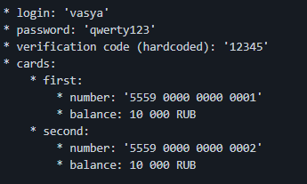

### DESCRIPTION

Дан пользователь с захардкоженными данными.  

### TASK

Проверить функциональность перевода денег между своими счетами.

### LAUNCH

1. Запускаем приложение ``java -jar ./artifacts/app-ibank-build-for-testers.jar``
1. Запуск в браузере http://localhost:9999/

### TOOLS

 CI AppVeyor  
Page Object
Java, JUnit5, Gradle, Selenide, Lombok

### COMPLEXITY

Необходимость придерживаться определенного порядка тестов (можно было использовать аннотацию @Order)

### CONCLUSION

[Возникновение отрицательного баланса в приложении при переводе денег между картами](https://github.com/Kasparidi/PageObjects/issues)
